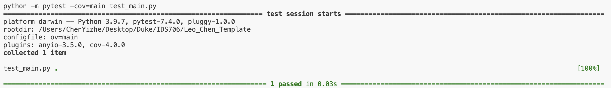

# Leo_Chen_Template

This repository hosts my submission for the Create Python Template assignment. To use this template, connect to a GitHub Codespace and allow the devcontainer to execute the Makefile, which will perform the following tasks: install, format, lint, and test.

Repository Contents:

* `main.py`

* `test_main.py`

* `.devcontainer`

* `hello.yml`

* `Makefile`

* `requirements.txt`

* `README.md`

## Project Objective

The goal of this project is to provide a Python template that includes a `main.py` file with a function named `square_number(x)`. This function takes a number as input and returns its square. The functionality of this function is verified through tests in the `test_main.py` file.

## Setup Instructions

1. Open codespaces

2. Load the repository into codespaces

3. Run the Makefile command: `make all`

## Result

